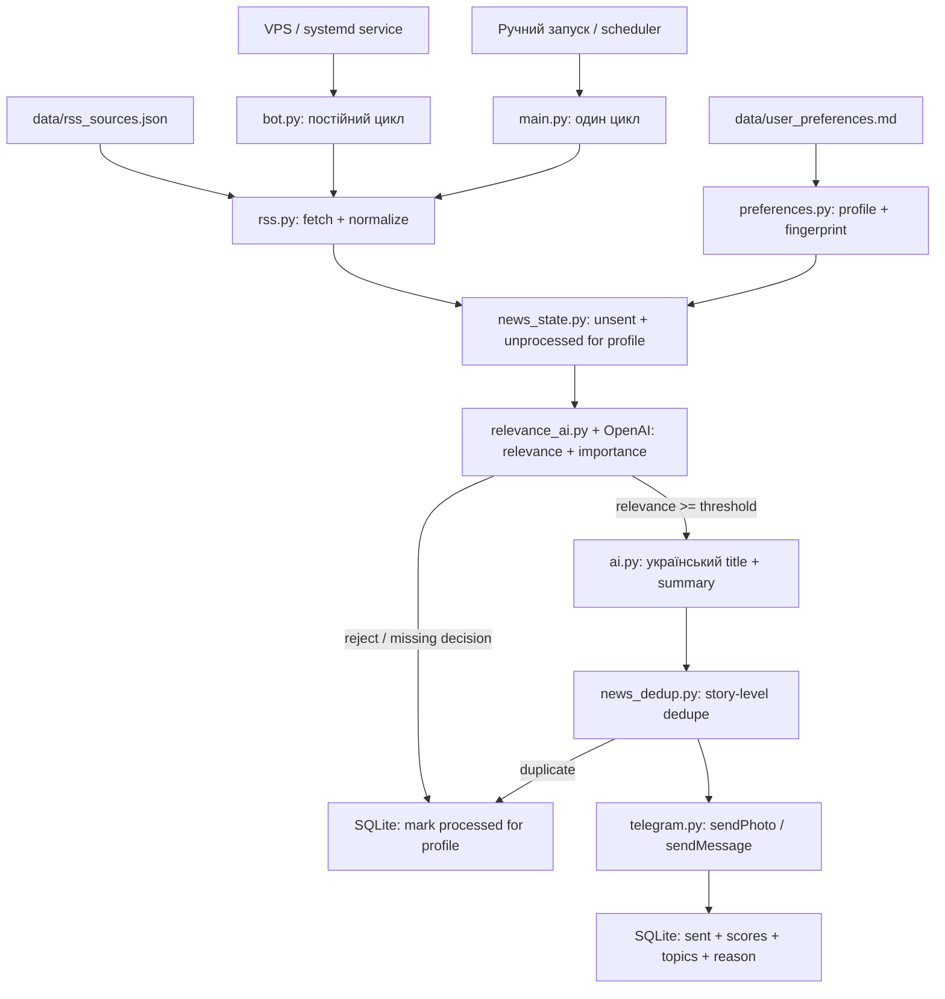

# AI Telegram News Bot

Telegram-бот для персоналізованих новин. Він читає RSS-джерела, порівнює кожну
новину з профілем користувача через OpenAI, підсумовує лише релевантні матеріали
українською і надсилає їх окремими Telegram-картками.

Основний режим — постійний процес `bot.py`. `main.py` запускає один повний цикл
для ручної перевірки або зовнішнього scheduler.

## Як працює pipeline



`relevance_score` визначає, наскільки новина відповідає особистому профілю.
`importance_score` не є глобальним фільтром: він лише допомагає ранжувати два
релевантні матеріали з однаковим рівнем збігу. Підсумовування запускається після
відбору, тому OpenAI не витрачає другий запит на відхилені новини.

## Профіль і зразок промпту

Робочий зразок лежить у `data/user_preferences.md`. У ньому окремо описані:

- мета відбору;
- теми `футбол`, `бокс`, `політика`;
- правила `Цікавить` і `Не цікавить` для кожної теми;
- вимога важливості саме для політичних новин;
- поведінка при чутках, слабкому контексті, keyword-only збігах та невпевненості.

Редагуй цей файл як звичайний Markdown. Після зміни тексту бот створить новий
fingerprint профілю і повторно оцінить ще актуальні, але раніше відхилені RSS-
матеріали. Уже надіслані посилання повторно не надсилаються.

Альтернативно весь текст можна передати через `USER_NEWS_PREFERENCES`. Ця змінна
має пріоритет над файлом, але для довгого профілю файл простіший і надійніший.

## Структурований результат OpenAI

Класифікатор використовує strict Structured Outputs і очікує для кожної новини:

```json
{
  "id": "item_1",
  "link": "https://example.com/news",
  "is_relevant": true,
  "relevance_score": 92,
  "importance_score": 78,
  "matched_topics": ["football"],
  "category": "sports",
  "event_type": "tournament_final",
  "reason_uk": "Фінал великого турніру прямо відповідає профілю."
}
```

Код додатково перевіряє діапазон score, повноту batch-відповіді, truncation,
refusal та відповідність рішення реальному input ID. Пропущена або ненадійна
відповідь відхиляється консервативно.

## Структура

```text
.
├── bot.py                      # постійний цикл
├── main.py                     # один ручний цикл
├── preferences.py              # завантаження і fingerprint профілю
├── relevance_ai.py             # персональний OpenAI-класифікатор
├── ai.py                       # український заголовок і summary
├── rss.py                      # RSS fetch/normalize/deduplicate
├── news_state.py               # SQLite sent/processed + AI metadata
├── news_dedup.py               # дедуплікація однієї події між джерелами
├── telegram.py                 # Telegram sendPhoto/sendMessage
├── config.py                   # env vars і каталог джерел
├── data/
│   ├── user_preferences.md     # персональний prompt-профіль
│   ├── rss_sources.json        # каталог RSS-джерел
│   └── newsbot.db              # runtime SQLite, створюється автоматично
└── tests/
```

## Налаштування

```bash
pip install -r requirements.txt
```

Мінімальний `.env`:

```text
TELEGRAM_BOT_TOKEN=...
TELEGRAM_CHAT_ID=...
OPENAI_API_KEY=...
OPENAI_MODEL=gpt-4o-mini
```

Основні додаткові змінні:

- `NEWS_PREFERENCES_PATH` — файл профілю, default `data/user_preferences.md`;
- `USER_NEWS_PREFERENCES` — inline-профіль, має пріоритет над файлом;
- `NEWS_MIN_RELEVANCE_SCORE` — мінімальний score збігу, default `70`;
- `NEWS_MAX_CANDIDATES_PER_RUN` — максимум кандидатів на AI-відбір, default `36`;
- `NEWS_MAX_ITEMS_PER_RUN` — максимум відправок за цикл, `0` без ліміту;
- `OPENAI_RELEVANCE_BATCH_SIZE` — batch класифікації, default `6`;
- `OPENAI_RELEVANCE_MAX_TOKENS` — output token limit, default `5000`;
- `OPENAI_RELEVANCE_RETRY_MISSING_LIMIT` — окремі retry для пропущених рішень,
  default `0`;
- `OPENAI_SUMMARY_BATCH_SIZE` — batch підсумовування, default `4`;
- `NEWS_LOOKBACK_HOURS` — вікно RSS, default `24`;
- `NEWS_POLL_INTERVAL_SECONDS` — пауза `bot.py`, default `300`;
- `NEWS_STATE_DB_PATH` — SQLite, default `data/newsbot.db`.

## Запуск

```bash
python bot.py
```

Один цикл:

```bash
python main.py
```

Очікувані логи:

- `AI relevance accepted (...)` — новина пройшла персональний фільтр;
- `AI relevance rejected (...)` — новина не відповідає профілю або threshold;
- `OpenAI omitted ... relevance decision(s)` — batch був неповним;
- `No news items matched the preference profile.` — збігів немає;
- `Skipping duplicate story from ...` — подію вже покрило інше джерело;
- `Sent N personalized news item(s).` — успішна відправка в постійному режимі.

## SQLite state

`sent_news` зберігає посилання, story fingerprint, profile key, relevance score,
importance score, matched topics і коротку причину рішення. `processed_news`
зберігає profile key, тому незмінний профіль не класифікує те саме повторно, а
після редагування профілю актуальні відхилені новини можна переоцінити.
Якщо встановлено ліміт відправок за цикл, релевантні матеріали понад ліміт не
позначаються обробленими й залишаються на наступний цикл.

Стара база оновлюється автоматично через додавання нових колонок. Legacy JSON
може бути імпортований під час першого відкриття порожньої бази.

## RSS-джерела

Каталог лежить у `data/rss_sources.json`. Поле `enabled: false` вимикає джерело.
Якщо одне джерело недоступне, бот логує warning і продовжує з іншими.
