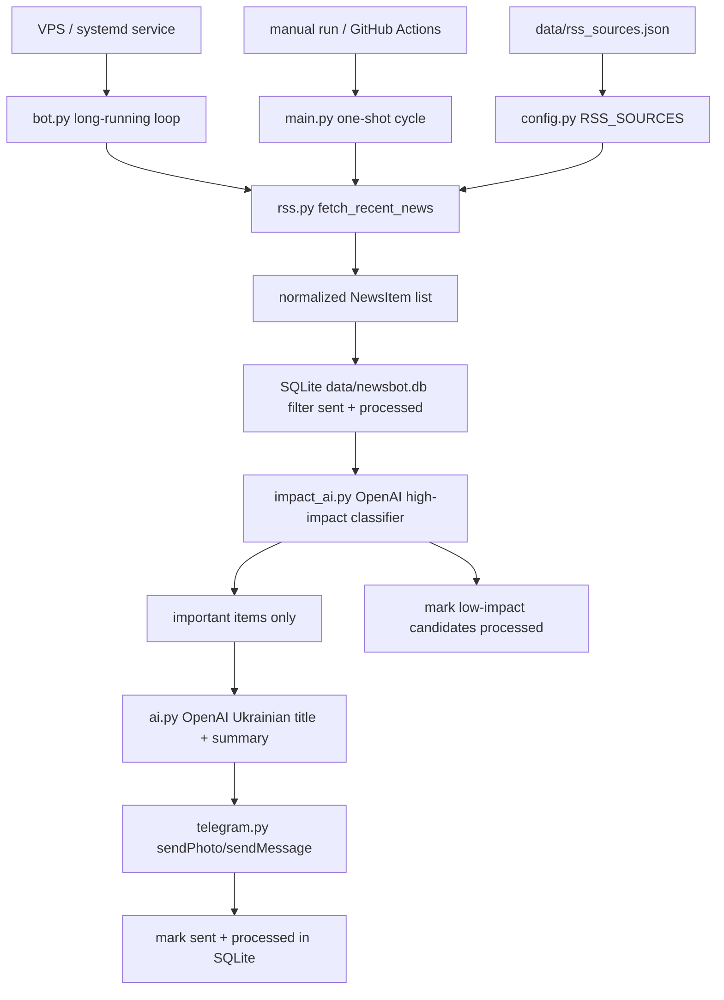

# AI Telegram News Bot

Telegram-бот для near-real-time high-impact новин. Основний режим роботи: постійний процес на VPS (`bot.py`), який часто читає RSS-джерела, просить OpenAI оцінити вагу кожної новини, підсумовує тільки важливі матеріали й надсилає кожну важливу новину окремою Telegram-карткою.

`main.py` лишається ручним one-shot fallback для перевірки або запуску через GitHub Actions.

## Як працює pipeline



Головна ідея: бот не питає користувача про теми. Він читає широку стрічку джерел і відправляє тільки події з реальною вагою: війни, ескалації, великі рішення держав, економічні шоки, серйозні технологічні події, катастрофи, а спорт лише коли це фінал, титульний бій, світовий скандал або подія глобального масштабу.

## Структура

```text
.
├── bot.py                 # постійний VPS-процес
├── main.py                # ручний one-shot запуск
├── rss.py                 # RSS fetch/normalize/deduplicate
├── impact_ai.py           # OpenAI класифікація важливості
├── ai.py                  # OpenAI заголовок і summary українською
├── telegram.py            # відправка в Telegram
├── news_state.py          # SQLite sent/processed state
├── config.py              # env vars + завантаження source catalog
├── data/
│   ├── rss_sources.json   # каталог RSS-джерел
│   ├── newsbot.db         # runtime SQLite DB, створюється автоматично і не комітиться
│   └── sent_news.json     # legacy import зі старої архітектури
└── tests/
```

## Налаштування

Встанови залежності:

```bash
pip install -r requirements.txt
```

У `.env` потрібні мінімум:

```text
TELEGRAM_BOT_TOKEN=...
TELEGRAM_CHAT_ID=...
OPENAI_API_KEY=...
```

Додаткові змінні:

- `NEWS_SOURCES_PATH` — шлях до каталогу RSS, default `data/rss_sources.json`;
- `NEWS_STATE_DB_PATH` — SQLite database, default `data/newsbot.db`;
- `SENT_NEWS_PATH` — legacy JSON для першого імпорту старої історії, default `data/sent_news.json`;
- `PROCESSED_NEWS_PATH` — legacy JSON для першого імпорту старого processed-cache, default `data/processed_news.json`;
- `NEWS_LOOKBACK_HOURS` — RSS-вікно, default `24`;
- `NEWS_MIN_IMPACT_SCORE` — мінімальний impact score для відправки, default `75`;
- `NEWS_MAX_CANDIDATES_PER_RUN` — максимум RSS-кандидатів, які OpenAI класифікує за один цикл; `0` означає без ліміту, default `36`;
- `NEWS_MAX_ITEMS_PER_RUN` — максимум відправок за цикл; `0` означає без ліміту, default `0`;
- `NEWS_POLL_INTERVAL_SECONDS` — пауза між циклами `bot.py`, default `300`;
- `OPENAI_IMPACT_BATCH_SIZE` — batch size для impact classification, default `6`;
- `OPENAI_IMPACT_MAX_TOKENS` — max tokens для impact classification, default `5000`.
- `OPENAI_IMPACT_RETRY_MISSING_LIMIT` — скільки пропущених OpenAI batch-рішень повторювати окремими запитами; default `0`.
- `OPENAI_SUMMARY_BATCH_SIZE` — batch size для summary/title generation, default `4`.

## Запуск

Постійний VPS-режим:

```bash
python bot.py
```

Ручна перевірка одного циклу:

```bash
python main.py
```

Очікувані логи:

- `Fetching RSS source: ...` — бот читає RSS;
- `Limiting AI impact candidates from ...` — бот обмежив великий backlog RSS-кандидатів для цього циклу;
- `AI impact accepted (...)` — новина пройшла high-impact фільтр;
- `AI impact rejected (...)` — новина визнана недостатньо важливою;
- `OpenAI omitted ... retry is disabled...` — OpenAI не повернув частину batch-рішень, бот не робить дорогі retry й відхиляє їх консервативно;
- `OpenAI omitted summary; using fallback summary...` — OpenAI не повернув summary для однієї важливої новини, бот використав fallback з оригінального title/description;
- `No high-impact news items to send.` — новини були, але нічого достатньо важливого;
- `Sent N high-impact news item(s).` — успішна відправка в `bot.py`.

## SQLite state

SQLite тепер головне сховище стану. Таблиці:

- `sent_news` — лінки, які вже були відправлені;
- `processed_news` — лінки, які вже були класифіковані, але могли бути відхилені як low-impact.

При першому запуску `news_state.py` автоматично імпортує старий `sent_news.json` / `processed_news.json`, якщо SQLite-таблиці ще порожні. Після цього JSON-файли більше не є основною пам’яттю бота.

`data/newsbot.db` є runtime-файлом і ігнорується git. На VPS його потрібно берегти як локальний state: якщо видалити цей файл, бот втратить історію `sent_news` / `processed_news` після останнього імпорту legacy JSON.

## RSS-джерела

Каталог лежить у `data/rss_sources.json`. Щоб вимкнути джерело, постав:

```json
{
  "enabled": false
}
```

Щоб додати нове:

```json
{
  "name": "New Source",
  "url": "https://example.com/rss.xml",
  "category": "world",
  "priority": "normal",
  "enabled": true
}
```

Якщо одне RSS-джерело зламається, бот залогує warning і продовжить роботу з іншими джерелами.

## GitHub Actions fallback

`.github/workflows/news.yml` лишається ручним fallback через `workflow_dispatch`. Основний runtime має бути VPS, бо тільки він дає часті перевірки й near-real-time відправку.

Fallback запускає `main.py`, але не комітить SQLite state назад у репозиторій. Не тримай одночасно активними VPS-процес і регулярний GitHub Actions scheduler, інакше можливі дублікати або гонки стану.
